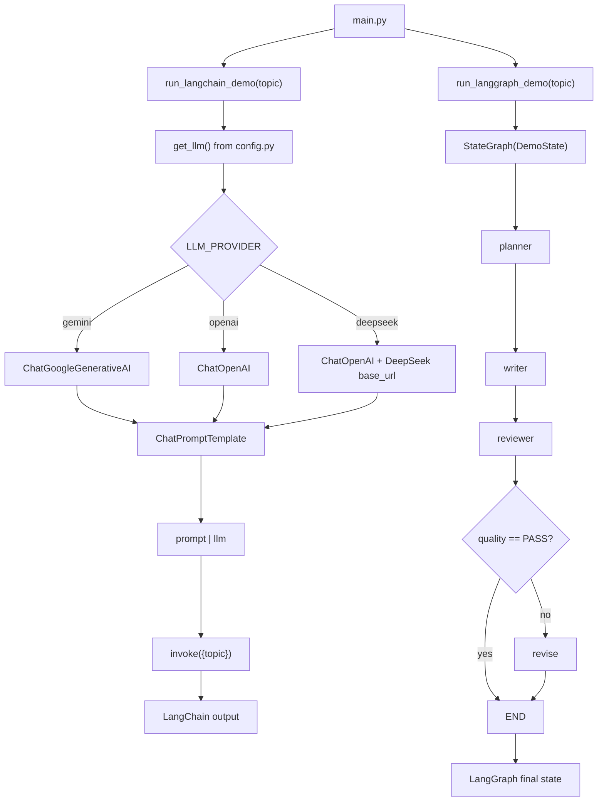

# LangChain + LangGraph Multi-Provider Demo

A minimal Python demo project that shows:

- `LangChain`: prompt + model composition
- `LangGraph`: small stateful workflow graph
- Switchable LLM providers: `Gemini`, `OpenAI`, `DeepSeek`

## 1) Setup (uv)

```bash
uv venv
source .venv/bin/activate
uv sync
cp .env.example .env
```

Edit `.env` and set:

```bash
LLM_PROVIDER=gemini

# for Gemini
GOOGLE_API_KEY=your_real_key
GEMINI_MODEL=gemini-2.0-flash
```

Or switch provider:

```bash
# OpenAI
LLM_PROVIDER=openai
OPENAI_API_KEY=your_real_key
OPENAI_MODEL=gpt-4o-mini
```

```bash
# DeepSeek
LLM_PROVIDER=deepseek
DEEPSEEK_API_KEY=your_real_key
DEEPSEEK_MODEL=deepseek-chat
# optional
DEEPSEEK_BASE_URL=https://api.deepseek.com/v1
```

## 2) Run demos

Run both:

```bash
uv run python main.py
```

Run only LangChain:

```bash
uv run python -m demo.langchain_demo
```

Run only LangGraph:

```bash
uv run python -m demo.langgraph_demo
```

## 3) Key concepts used

### LangChain concepts in this project

- `ChatPromptTemplate`:
  - Used in `src/demo/langchain_demo.py` to define system + human messages.
- Runnable composition (`prompt | llm`):
  - The prompt and model are composed into one executable chain.
- `invoke(...)`:
  - Executes the chain with runtime variables (`topic`) and returns model output.
- Provider abstraction:
  - `src/demo/config.py` returns a unified chat model instance while switching provider via env vars.

### LangGraph concepts in this project

- `StateGraph`:
  - Defines a typed, stateful workflow with shared `DemoState`.
- Typed state (`TypedDict`):
  - Keeps graph data explicit: `topic`, `plan`, `draft`, `quality`.
- Nodes:
  - `planner`, `writer`, `reviewer`, `revise` each transform shared state.
- Edges and control flow:
  - `START -> planner -> writer -> reviewer`.
- Conditional routing:
  - `add_conditional_edges(...)` uses `route_after_review` to decide `revise` vs `END`.
- Graph compile + run:
  - `graph.compile()` creates executable graph, then `app.invoke(initial_state)` runs it.

## 4) Code flow diagram



## Project structure

```text
langchain-langgraph-gemini-demo/
├── .env.example
├── main.py
├── pyproject.toml
├── README.md
└── src/
    └── demo/
        ├── __init__.py
        ├── config.py
        ├── langchain_demo.py
        └── langgraph_demo.py
```

## Notes

- This is intentionally small and demo-first.
- `LLM_MODEL` can be set to override provider-specific model env vars.
- For production usage, add retries, observability, and structured output parsing.
